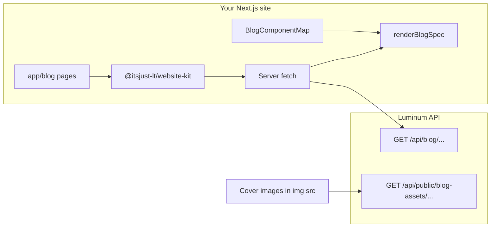

# Implementing the Luminum blog on a client (marketing) website

This guide is for **your own Next.js site** (App Router) that should list and render blog posts managed in the Luminum dashboard. It complements the API reference in [`blog-ssr-contract.md`](./blog-ssr-contract.md) and the package examples in [`packages/website-kit/README.md`](../packages/website-kit/README.md).

---

## 1. How it fits together



- **Data**: Your site calls the Luminum API with a **Website ID** (UUID from the dashboard). The API resolves the organization and returns **published** posts and **`renderSpec`** (sanitized HTML + allowlisted components).
- **Rendering**: Markdown-like content is **not** executed as code. You pass a fixed **`BlogComponentMap`** (your React components) to `renderBlogSpec`.
- **Images**: `coverImageUrl` and inline image URLs in content point at **`/api/public/blog-assets/...`** on the same API host (full URLs in JSON).
- **Gate**: If **blogs are disabled** for the organization, public blog endpoints return **404**; your pages should treat that as “no blog” / `notFound()` as appropriate.

---

## 2. Prerequisites in Luminum

1. **Website** linked to your organization (you have a **Website ID** UUID).
2. **Blogs enabled** for that organization (Luminum admin / feature flag).
3. **Organization metadata** should include a public site base URL so SEO payloads are correct, e.g. in metadata JSON used by the API: `publicBaseUrl`, or `baseUrl`, or `siteUrl` — used to build `canonicalUrl` and Open Graph URLs for **your** domain, not the API host. Set this in Luminum where organization/site marketing URL is configured.
4. **Install auth** for GitHub Packages if you consume published packages from the registry ([`github-packages.md`](./github-packages.md)).

---

## 3. Install dependencies

```bash
pnpm add @itsjust-lt/website-kit
```

Monorepo consumers can use:

```json
"@itsjust-lt/website-kit": "workspace:*"
```

`website-kit` depends on `@itsjust-lt/blog-renderer`; both must be **transpiled** by Next (next section).

---

## 4. Environment variables

Use **server-side** variables in `getPublishedPosts` / `getPublishedPostBySlug` (Server Components / `generateMetadata`).

| Variable | Required | Purpose |
|----------|----------|---------|
| `LUMINUM_WEBSITE_ID` | Yes (server) | UUID of the website; passed as `websiteId` to all blog fetch helpers. |
| `LUMINUM_API_URL` | Recommended | Base URL of the Luminum API (e.g. `https://api.luminum.app`). If omitted, website-kit defaults to production API URL. |
| `NEXT_PUBLIC_LUMINUM_WEBSITE_ID` | Optional | Same UUID if you need it in client components; **blog fetching should stay on the server** when possible. |

Example `.env.local`:

```env
LUMINUM_WEBSITE_ID=xxxxxxxx-xxxx-xxxx-xxxx-xxxxxxxxxxxx
LUMINUM_API_URL=https://api.luminum.app
```

**Never** expose service keys on the public blog pages; blog read endpoints are unauthenticated but rate-limited and scoped by `websiteId`.

---

## 5. Next.js configuration

### 5.1 Transpile packages

The packages ship TypeScript source. Next must compile them:

```ts
// next.config.ts
import type { NextConfig } from "next";

const nextConfig: NextConfig = {
  transpilePackages: ["@itsjust-lt/website-kit", "@itsjust-lt/blog-renderer"],
};

export default nextConfig;
```

### 5.2 Optional: fail build if Website ID is missing

```ts
// next.config.ts (or a small imported script run at build time)
import { assertLuminumWebsiteIdsAtBuild } from "@itsjust-lt/website-kit/env";

// After loading dotenv / env in CI:
assertLuminumWebsiteIdsAtBuild();
```

This uses `NEXT_PUBLIC_LUMINUM_WEBSITE_ID` and optionally checks it matches `LUMINUM_WEBSITE_ID`. Set `SKIP_LUMINUM_WEBSITE_ID_CHECK=1` only if you intentionally skip (e.g. storybook).

---

## 6. Shared blog config helper

Centralize options so every fetch uses the same API base and website ID:

```ts
// lib/luminum-blog.ts
import type { BlogFetchOptions } from "@itsjust-lt/website-kit/blog";

export function luminumBlogOpts(
  extra?: Partial<BlogFetchOptions>
): BlogFetchOptions {
  return {
    websiteId: process.env.LUMINUM_WEBSITE_ID!,
    apiBaseUrl: process.env.LUMINUM_API_URL,
    ...extra,
  };
}
```

---

## 7. Component map (required for custom blocks)

The API only emits these **names** (exact spelling):  
`Callout`, `Image`, `Button`, `Accordion`, `Gallery`, `Video`, `CodeBlock`, `AuthorCard`.

You **must** provide a React component for each name you might use in posts. Unknown names render an error placeholder from the renderer.

### 7.1 Prop reference (what the API stores)

Props are JSON-serializable (string, number, boolean, or JSON objects/arrays where noted).

| Component | Props | Notes |
|-----------|--------|--------|
| **Callout** | `variant` (string, required), `title?`, `children` | Children come from nested blocks. |
| **Image** | `src`, `alt` (required), `width?`, `height?`, `caption?`, `rounded?`, `objectFit?`, `layout?`, `maxWidth?` | `src` is typically a full URL to public blog assets. |
| **Button** | `href`, `label` (required), `variant?` | Render as `<a>` (or wrap Link). |
| **Accordion** | `items` (required, JSON array of `{ title, content }`) | |
| **Gallery** | `images` (required, JSON array of `{ src, alt? }`), `columns?` | |
| **Video** | `src` (required), `poster?`, `title?`, `width?`, `height?` | |
| **CodeBlock** | `code` (required), `language?`, `filename?`, `showLineNumbers?` | |
| **AuthorCard** | `name` (required), `bio?`, `avatarSrc?`, `url?` | |

Implement the map in one module, e.g. `components/blog/luminum-blog-map.tsx`, and export `BlogComponentMap`. A full starter implementation lives in [`packages/website-kit/README.md`](../packages/website-kit/README.md) (section *Setting up blog components*).

### 7.2 Markdown blocks

Everything else is `type: "markdown"` with **sanitized HTML**. Style it with Tailwind Typography (`prose`) or pass `markdownClassName` into `renderBlogSpec` (see below).

---

## 8. Blog index page (list)

```tsx
// app/blog/page.tsx
import Link from "next/link";
import { getPublishedPosts } from "@itsjust-lt/website-kit/blog";
import { luminumBlogOpts } from "@/lib/luminum-blog";

export default async function BlogIndexPage() {
  const { posts, totalPages } = await getPublishedPosts({
    ...luminumBlogOpts(),
    page: 1,
    limit: 12,
  });

  return (
    <main className="mx-auto max-w-3xl px-4 py-12">
      <h1 className="text-3xl font-bold">Blog</h1>
      <ul className="mt-8 space-y-8">
        {posts.map((post) => (
          <li key={post.id}>
            <Link href={`/blog/${post.slug}`} className="block rounded-lg border p-4 hover:bg-muted/40">
              {/* eslint-disable-next-line @next/next/no-img-element */}
              
              <h2 className="text-xl font-semibold">{post.title}</h2>
              {post.publishedAt && (
                <time dateTime={post.publishedAt} className="text-sm text-muted-foreground">
                  {new Date(post.publishedAt).toLocaleDateString()}
                </time>
              )}
              {post.categories?.length ? (
                <p className="mt-2 text-xs text-muted-foreground">{post.categories.join(" · ")}</p>
              ) : null}
            </Link>
          </li>
        ))}
      </ul>
      {totalPages > 1 && <p className="mt-8 text-sm text-muted-foreground">More pages: implement ?page= or dynamic segments.</p>}
    </main>
  );
}
```

**Pagination**: call `getPublishedPosts` with `page` and `limit` until `page >= totalPages`.

**404 from API**: if blogs are disabled, the API returns 404; wrap the fetch in `try/catch` and render an empty list or a friendly message.

---

## 9. Blog post page (detail + SEO)

### 9.1 Metadata

```tsx
// app/blog/[slug]/page.tsx
import { notFound } from "next/navigation";
import {
  getPublishedPostBySlug,
  renderBlogSpec,
  type BlogComponentMap,
} from "@itsjust-lt/website-kit/blog";
import { blogSeoToMetadata } from "@itsjust-lt/website-kit/metadata";
import { luminumBlogOpts } from "@/lib/luminum-blog";
import { luminumBlogMap } from "@/components/blog/luminum-blog-map";

type Props = { params: Promise<{ slug: string }>; searchParams?: Promise<{ previewToken?: string }> };

export async function generateMetadata({ params, searchParams }: Props) {
  const { slug } = await params;
  const { previewToken } = (await searchParams) ?? {};

  const data = await getPublishedPostBySlug({
    ...luminumBlogOpts({
      previewToken,
      noStore: Boolean(previewToken),
    }),
    slug,
  });

  if (!data) return { title: "Not found" };

  return blogSeoToMetadata(data.seo);
}

export default async function BlogPostPage({ params, searchParams }: Props) {
  const { slug } = await params;
  const { previewToken } = (await searchParams) ?? {};

  const data = await getPublishedPostBySlug({
    ...luminumBlogOpts({
      previewToken,
      noStore: Boolean(previewToken),
    }),
    slug,
  });

  if (!data) notFound();

  const isPreview = Boolean(data.preview);

  return (
    <article className="mx-auto max-w-3xl px-4 py-12">
      {isPreview && (
        <p className="mb-6 rounded-md border border-amber-500/50 bg-amber-500/10 px-3 py-2 text-sm">
          Draft preview — not indexed; do not share publicly.
        </p>
      )}
      {/* eslint-disable-next-line @next/next/no-img-element */}
      
      <h1 className="text-4xl font-bold tracking-tight">{data.post.title}</h1>
      {data.post.publishedAt && (
        <time dateTime={data.post.publishedAt} className="mt-2 block text-sm text-muted-foreground">
          {new Date(data.post.publishedAt).toLocaleDateString()}
        </time>
      )}

      <div
        className={
          isPreview
            ? "prose prose-neutral mt-10 max-w-none dark:prose-invert"
            : "mt-10"
        }
      >
        {renderBlogSpec(data.renderSpec, luminumBlogMap as BlogComponentMap, {
          rootClassName: "space-y-6",
          markdownClassName:
            "blog-body prose prose-neutral max-w-none dark:prose-invert prose-headings:scroll-mt-24 prose-img:rounded-lg",
        })}
      </div>

      {data.seo.jsonLd && !isPreview && (
        <script
          type="application/ld+json"
          dangerouslySetInnerHTML={{ __html: JSON.stringify(data.seo.jsonLd) }}
        />
      )}
    </article>
  );
}
```

Notes:

- **`blogSeoToMetadata(data.seo)`** maps title, description, canonical, Open Graph, Twitter, and **`robots`** when the API sends `noindex` for previews.
- **`previewToken`**: when present, use **`noStore: true`** (website-kit does this when `previewToken` is set) so drafts are not cached like production.
- **Duplicate titles**: if you show `<h1>{data.post.title}</h1>` and the body also starts with an H1 of the same text, remove one for accessibility/SEO.
- **`renderSpec` null**: rare for published posts; if null, handle gracefully (show message or `notFound()`).

---

## 10. Draft preview from the dashboard

In the dashboard, “View on site” opens your URL with query params. Your post page must read **`previewToken`** (and keep **`websiteId`** in env — already covered).

Ensure your marketing domain matches what you configured for preview links. The API validates the token and **post scope** (token is tied to the post).

If your preview URL used **`organizationId`** historically, the raw API accepts it; **website-kit** only passes **`websiteId`** — keep using the env Website ID on the client site.

---

## 11. Caching and revalidation

- Default blog fetches use Next `fetch` with **`revalidate: 300`** (5 minutes) unless overridden.
- Each request merges **`next.tags`** including `luminum-blog-{websiteId}` plus any **`revalidateTags`** you pass in `BlogFetchOptions`.
- **Preview / `noStore`**: no default revalidate; `cache: 'no-store'`.

**On-demand revalidation** after a publish (optional):

1. From your site, expose a Route Handler that calls `revalidateTag('luminum-blog-{WEBSITE_UUID}')` (use the same normalized UUID as env).
2. Trigger it from a webhook or manually after publishing.

You can add custom tags via `revalidateTags: ['my-site-blog']` and revalidate those instead.

---

## 12. Sitemap

Merge static routes with blog URLs:

```ts
// app/sitemap.ts
import type { MetadataRoute } from "next";
import { getBlogSitemapEntries } from "@itsjust-lt/website-kit/metadata";

export default async function sitemap(): Promise<MetadataRoute.Sitemap> {
  const base = "https://yoursite.com";

  const staticRoutes: MetadataRoute.Sitemap = [
    { url: base, lastModified: new Date(), changeFrequency: "weekly", priority: 1 },
    { url: `${base}/blog`, lastModified: new Date(), changeFrequency: "weekly", priority: 0.9 },
  ];

  const blogEntries = await getBlogSitemapEntries({
    websiteId: process.env.LUMINUM_WEBSITE_ID!,
    apiBaseUrl: process.env.LUMINUM_API_URL,
    baseUrl: base,
    blogPathPrefix: "/blog",
  });

  return [...staticRoutes, ...blogEntries];
}
```

If blogs are disabled or the API errors, **`getBlogSitemapEntries`** returns **no** blog rows (safe to spread).

---

## 13. Optional features

| Feature | website-kit helper |
|--------|---------------------|
| Search | `searchPosts({ q, category, page, limit, ... })` |
| Category list | `getCategories` |
| Posts by category | `getPostsByCategory({ categorySlug, ... })` |
| All posts (e.g. static paths) | `getAllPublishedPosts` |

Pass **`previewToken`** only where you intentionally allow draft search/list (rare on public sites).

---

## 14. Security and trust boundaries

- Treat **`renderSpec`** as **content**, not code. Only render via **`renderBlogSpec`** + your **fixed** component map.
- Do not pass arbitrary component names from the URL into dynamic imports.
- Image `src` values are constrained by Luminum publish rules; still use `next/image` with **`remotePatterns`** if you want optimization — add your API host pattern.

---

## 15. Troubleshooting

| Symptom | Likely cause |
|--------|----------------|
| 404 on all blog routes | `blogs_enabled` false, wrong `websiteId`, or wrong `apiBaseUrl`. |
| Empty list, no error | Catch errors from `getPublishedPosts`; log `res.status`. |
| Components show “Unknown blog component” | Missing key in `BlogComponentMap` or typo in name. |
| Styles missing on markdown | Add Tailwind Typography (`@tailwindcss/typography`) and `prose` classes, or set `markdownClassName`. |
| Centered headings lost | Republish after API sanitizer allows `text-align` (recent Luminum versions). |
| Preview 404 | Expired token, wrong slug, or token for a different post. |
| Wrong canonical / OG URL | Set organization **public base URL** in Luminum metadata. |

---

## 16. Checklist

- [ ] `LUMINUM_WEBSITE_ID` and `LUMINUM_API_URL` set on server
- [ ] `transpilePackages` includes website-kit and blog-renderer
- [ ] `BlogComponentMap` implements all components you use in posts
- [ ] `/blog` list + `/blog/[slug]` pages implemented
- [ ] `generateMetadata` + optional JSON-LD script for articles
- [ ] Preview query param `previewToken` supported if editors use “View on site”
- [ ] Sitemap merges `getBlogSitemapEntries`
- [ ] (Optional) `revalidateTag` webhook after publish

For raw HTTP shapes and cache behavior, see [`blog-ssr-contract.md`](./blog-ssr-contract.md).
